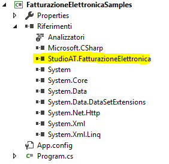

## Fatturazione elettronica verso la Pubblica Amministrazione e privati

### Descrizione
La libreria è stata sviluppata in c# in base alla documentazione fornita al seguente link [Documentazione Fattura PA](https://www.fatturapa.gov.it/it/norme-e-regole/documentazione-fatturapa/)

La libreria è completa di tutti i type per creare una fattura completa con le specifiche [v. 1.3.1](https://www.fatturapa.gov.it/export/documenti/Specifiche_tecniche_del_formato_FatturaPA_V1.3.1.pdf)  in base alle proprie esigenze

Possono essere create fatture con schema 1.0, 1.1, 1.2, 1.2.1

La versione 1.2.1 può essere utilizzata dal 1 ottobre 2020 mentre la 1.2 può essere utilizzata fino al 31 dicembre 2020

La libreria non ha un metodo per la convalida della fattura

Sono presenti i seguenti metodi:

- *TryValidateXML* per validare la fattura con lo schema xsd

- *CreateHTML* per generare il file HTML con stile di default o personalizzato

- *CreateXML* per generare il file XML

- *CreateInvoice* per generare l'oggetto fattura da file XML o stream

- *GetProgressivoFile*

```csharp
            // codifica in base36 per 5 caratteri (range 1..60466176 (ProgressivoFile.GetNumeroProgressivo("ZZZZZ")))
            ProgressivoFile progressivoFile = new ProgressivoFile(1);
            if (progressivoFile.IsValid())
            {
                string nomeFile = $"IT01234567890_{progressivoFile.GetProgressivoFile()}";
            }  
```

- *GetVersion* per restituire l'attributo versione dell'xml da file o stream

### Librerie facoltative di supporto
- *Fatturazione elettronica semplificata* al [seguente link](https://github.com/nicogis/FatturazioneElettronicaSemplificata)
- *Utilities per la fatturazione elettronica* al [seguente link](https://github.com/nicogis/FatturazioneElettronica-Extensions)
- *Client per web services Indice delle Pubbliche Amministrazioni* al [seguente link](https://github.com/nicogis/FatturazioneElettronica-IPA)


### Requisiti

E' richiesto il framework Microsoft .NET 4.6.2

### Esempio di creazione fattura



```csharp

#define v121
#define allegati

//-----------------------------------------------------------------------
// <copyright file="Program.cs" company="Studio A&T s.r.l.">
//     Copyright (c) Studio A&T s.r.l. All rights reserved.
// </copyright>
// <author>Nicogis</author>
//-----------------------------------------------------------------------

#if v10
using FatturazioneElettronica.Type.V_1_0;
#elif v11
using FatturazioneElettronica.Type.V_1_1;
#elif v12
using FatturazioneElettronica.Type.V_1_2;
#elif v121
using FatturazioneElettronica.Type.V_1_2_1;
#endif

using System;
using System.Collections.Generic;

public class Program
{
    public static void Main(string[] args)
    {

        FatturaElettronicaType fatturaElettronica = new FatturaElettronicaType();

#if v10
        fatturaElettronica.versione = VersioneSchemaType.Item10;
#elif v11
        fatturaElettronica.versione = VersioneSchemaType.Item11;
#elif v12 || v121
        fatturaElettronica.versione = FormatoTrasmissioneType.FPR12;
#endif

        FatturaElettronicaHeaderType fatturaElettronicaHeaderType = new FatturaElettronicaHeaderType();

        DatiTrasmissioneType datiTrasmissioneType = new DatiTrasmissioneType();

        IdFiscaleType idFiscaleTypeTrasmissione = new IdFiscaleType();
        idFiscaleTypeTrasmissione.IdCodice = "01234567890";
        idFiscaleTypeTrasmissione.IdPaese = "IT";

        datiTrasmissioneType.IdTrasmittente = idFiscaleTypeTrasmissione;
        datiTrasmissioneType.ProgressivoInvio = "00001";

#if v10
        datiTrasmissioneType.FormatoTrasmissione = FormatoTrasmissioneType.SDI10;
#elif v11
        datiTrasmissioneType.FormatoTrasmissione = FormatoTrasmissioneType.SDI11;
#elif v12 || v121
        datiTrasmissioneType.FormatoTrasmissione = FormatoTrasmissioneType.FPR12;
#endif

        datiTrasmissioneType.CodiceDestinatario = "AAAAAA";

        fatturaElettronicaHeaderType.DatiTrasmissione = datiTrasmissioneType;

        CedentePrestatoreType cedentePrestatoreType = new CedentePrestatoreType();

        DatiAnagraficiCedenteType datiAnagraficiCedenteType = new DatiAnagraficiCedenteType();

        IdFiscaleType idFiscaleTypeCedente = new IdFiscaleType();
        idFiscaleTypeCedente.IdPaese = "IT";
        idFiscaleTypeCedente.IdCodice = "01234567890";

        datiAnagraficiCedenteType.IdFiscaleIVA = idFiscaleTypeCedente;

        AnagraficaType anagraficaType = new AnagraficaType();

        
        anagraficaType.Items = new string[] { "ALPHA SRL" };
        anagraficaType.ItemsElementName = new ItemsChoiceType[] { ItemsChoiceType.Denominazione };
        
        datiAnagraficiCedenteType.Anagrafica = anagraficaType;

        cedentePrestatoreType.DatiAnagrafici = datiAnagraficiCedenteType;
#if v10
        datiAnagraficiCedenteType.RegimeFiscale = RegimeFiscaleType.RF18;
#else
        datiAnagraficiCedenteType.RegimeFiscale = RegimeFiscaleType.RF19;
#endif

        IndirizzoType indirizzoType = new IndirizzoType();
        indirizzoType.Indirizzo = "VIALE ROMA";
        indirizzoType.NumeroCivico = "543";
        indirizzoType.CAP = "07100";
        indirizzoType.Comune = "SASSARI";
        indirizzoType.Provincia = "SS";
        indirizzoType.Nazione = "IT";
        cedentePrestatoreType.Sede = indirizzoType;

        fatturaElettronicaHeaderType.CedentePrestatore = cedentePrestatoreType;

        CessionarioCommittenteType cessionarioCommittenteType = new CessionarioCommittenteType();

        DatiAnagraficiCessionarioType datiAnagraficiCessionarioType = new DatiAnagraficiCessionarioType();

        AnagraficaType anagraficaTypeCommittente = new AnagraficaType();
        anagraficaTypeCommittente.Items = new string[] { "AMMINISTRAZIONE BETA" };
        anagraficaTypeCommittente.ItemsElementName = new ItemsChoiceType[] { ItemsChoiceType.Denominazione };

        datiAnagraficiCessionarioType.Anagrafica = anagraficaTypeCommittente;
        datiAnagraficiCessionarioType.CodiceFiscale = "09876543210";
        cessionarioCommittenteType.DatiAnagrafici = datiAnagraficiCessionarioType;

        IndirizzoType indirizzoTypeCommittente = new IndirizzoType();
        indirizzoTypeCommittente.Indirizzo = "VIA TORINO 38-B";
        indirizzoTypeCommittente.CAP = "00145";
        indirizzoTypeCommittente.Comune = "ROMA";
        indirizzoTypeCommittente.Provincia = "RM";
        indirizzoTypeCommittente.Nazione = "IT";

        cessionarioCommittenteType.Sede = indirizzoTypeCommittente;

        fatturaElettronicaHeaderType.CessionarioCommittente = cessionarioCommittenteType;
        fatturaElettronica.FatturaElettronicaHeader = fatturaElettronicaHeaderType;

        FatturaElettronicaBodyType fatturaElettronicaBodyType = new FatturaElettronicaBodyType();
        DatiGeneraliType datiGeneraliType = new DatiGeneraliType();
        DatiGeneraliDocumentoType datiGeneraliDocumentoType = new DatiGeneraliDocumentoType();

        datiGeneraliDocumentoType.TipoDocumento = TipoDocumentoType.TD01;
        datiGeneraliDocumentoType.Divisa = "EUR";
        datiGeneraliDocumentoType.Data = new DateTime(2017,1,18);
        datiGeneraliDocumentoType.Numero = "123";

#if v10
        datiGeneraliDocumentoType.Causale = "LA FATTURA FA RIFERIMENTO AD UNA OPERAZIONE AAAA BBBBBBBBBBBBBBBBBB CCC DDDDDDDDDDDDDDD E FFFFFFFFFFFFFFFFFFFF GGGGGGGGGG HHHHHHH II LLLLLLLLLLLLLLLLL MMM NNNNN OO PPPPPPPPPPP QQQQ RRRR SSSSSSSSSSSSSS";
#else       
        datiGeneraliDocumentoType.Causale = new string[] {
            "LA FATTURA FA RIFERIMENTO AD UNA OPERAZIONE AAAA BBBBBBBBBBBBBBBBBB CCC DDDDDDDDDDDDDDD E FFFFFFFFFFFFFFFFFFFF GGGGGGGGGG HHHHHHH II LLLLLLLLLLLLLLLLL MMM NNNNN OO PPPPPPPPPPP QQQQ RRRR SSSSSSSSSSSSSS",
            "SEGUE DESCRIZIONE CAUSALE NEL CASO IN CUI NON SIANO STATI SUFFICIENTI 200 CARATTERI AAAAAAAAAAA BBBBBBBBBBBBBBBBB"
        };
#endif

        datiGeneraliType.DatiGeneraliDocumento = datiGeneraliDocumentoType;

        fatturaElettronicaBodyType.DatiGenerali = datiGeneraliType;

        DatiDocumentiCorrelatiType datiOrdineAcquistoType = new DatiDocumentiCorrelatiType();
        datiOrdineAcquistoType.RiferimentoNumeroLinea = new string[] { "1" };
        datiOrdineAcquistoType.IdDocumento = "66685";
        datiOrdineAcquistoType.NumItem = "1";
        datiOrdineAcquistoType.CodiceCUP = "123abc";
        datiOrdineAcquistoType.CodiceCIG = "456def";
        
        datiGeneraliType.DatiOrdineAcquisto = new DatiDocumentiCorrelatiType[] { datiOrdineAcquistoType };

        DatiDocumentiCorrelatiType datiContrattoType = new DatiDocumentiCorrelatiType();
        datiContrattoType.RiferimentoNumeroLinea = new string[] { "1" };
        datiContrattoType.IdDocumento = "123";
        datiContrattoType.NumItem = "5";
        datiContrattoType.CodiceCUP = "123abc";
        datiContrattoType.CodiceCIG = "456def";
        datiGeneraliType.DatiContratto = new DatiDocumentiCorrelatiType[] { datiContrattoType };

        DatiDocumentiCorrelatiType datiConvenzioneType = new DatiDocumentiCorrelatiType();
        datiConvenzioneType.RiferimentoNumeroLinea = new string[] { "1" };
        datiConvenzioneType.IdDocumento = "456";
        datiConvenzioneType.NumItem = "5";
        datiConvenzioneType.CodiceCUP = "123abc";
        datiConvenzioneType.CodiceCIG = "456def";
        datiGeneraliType.DatiConvenzione = new DatiDocumentiCorrelatiType[] { datiConvenzioneType };

        DatiDocumentiCorrelatiType datiRicezioneType = new DatiDocumentiCorrelatiType();
        datiRicezioneType.RiferimentoNumeroLinea = new string[] { "1" };
        datiRicezioneType.IdDocumento = "789";
        datiRicezioneType.NumItem = "5";
        datiRicezioneType.CodiceCUP = "123abc";
        datiRicezioneType.CodiceCIG = "456def";
        datiGeneraliType.DatiRicezione = new DatiDocumentiCorrelatiType[] { datiRicezioneType };

        DatiTrasportoType datiTrasportoType = new DatiTrasportoType();
        DatiAnagraficiVettoreType datiAnagraficiVettore = new DatiAnagraficiVettoreType();
        IdFiscaleType idFiscaleType = new IdFiscaleType();
        idFiscaleType.IdPaese = "IT";
        idFiscaleType.IdCodice = "4681012141";
        datiAnagraficiVettore.IdFiscaleIVA = idFiscaleType;
        AnagraficaType anagraficaTypeDT = new AnagraficaType();
        anagraficaTypeDT.Items = new string[] { "Trasporto spa" };
        anagraficaTypeDT.ItemsElementName = new ItemsChoiceType[] { ItemsChoiceType.Denominazione };
        datiAnagraficiVettore.Anagrafica = anagraficaTypeDT;
        datiTrasportoType.DatiAnagraficiVettore = datiAnagraficiVettore;
        datiTrasportoType.DataOraConsegnaSpecified = true;
        datiTrasportoType.DataOraConsegna = new DateTime(2017, 01, 16, 16, 46, 12);
        datiGeneraliType.DatiTrasporto = datiTrasportoType;

        DatiBeniServiziType datiBeniServiziType = new DatiBeniServiziType();
        DettaglioLineeType dettaglioLineeType = new DettaglioLineeType();
        dettaglioLineeType.NumeroLinea = "1";
        dettaglioLineeType.Descrizione = "DESCRIZIONE DELLA FORNITURA";
        dettaglioLineeType.Quantita = 5.00M;
        dettaglioLineeType.PrezzoUnitario = 1.00M;
        dettaglioLineeType.PrezzoTotale = 5.00M;
        dettaglioLineeType.AliquotaIVA = 22.00M;
        datiBeniServiziType.DettaglioLinee = new DettaglioLineeType[] { dettaglioLineeType };

        DatiRiepilogoType datiRiepilogoType = new DatiRiepilogoType();
        datiRiepilogoType.AliquotaIVA = 22.00M;
        datiRiepilogoType.ImponibileImporto = 5.00M;
        datiRiepilogoType.Imposta = 1.10M;
        datiRiepilogoType.EsigibilitaIVASpecified = true;
        datiRiepilogoType.EsigibilitaIVA = EsigibilitaIVAType.I;

        datiBeniServiziType.DatiRiepilogo = new DatiRiepilogoType[] { datiRiepilogoType };
        fatturaElettronicaBodyType.DatiBeniServizi = datiBeniServiziType;

        DatiPagamentoType datiPagamentoType = new DatiPagamentoType();
        datiPagamentoType.CondizioniPagamento = CondizioniPagamentoType.TP01;
        DettaglioPagamentoType dettaglioPagamentoType = new DettaglioPagamentoType();
        dettaglioPagamentoType.ModalitaPagamento = ModalitaPagamentoType.MP01;
        dettaglioPagamentoType.DataScadenzaPagamentoSpecified = true;
        dettaglioPagamentoType.DataScadenzaPagamento = new DateTime(2017, 2, 18);
        dettaglioPagamentoType.ImportoPagamento = 6.10M;
        datiPagamentoType.DettaglioPagamento = new DettaglioPagamentoType[] { dettaglioPagamentoType };

        fatturaElettronicaBodyType.DatiPagamento = new DatiPagamentoType[] { datiPagamentoType };

#if allegati
                
        string filePathAttachment = @"c:\temp\scratch\prova.pdf";
        if(File.Exists(filePathAttachment))
        {
            List<AllegatiType> allegatiTypes = new List<AllegatiType>();
            AllegatiType allegatiType = new AllegatiType();
            allegatiType.NomeAttachment = Path.ChangeExtension(Path.GetFileName(filePathAttachment), "zip");
            allegatiType.AlgoritmoCompressione = "zip".ToUpperInvariant();
            allegatiType.FormatoAttachment = Path.GetExtension(filePathAttachment).TrimStart('.').ToUpperInvariant();

            byte[] fileBytes = File.ReadAllBytes(filePathAttachment);
            byte[] compressedBytes = null;

            //creo lo zip in memoria
            using (var outStream = new MemoryStream())
            {
                using (var archive = new ZipArchive(outStream, ZipArchiveMode.Create, true))
                {
                    var fileInArchive = archive.CreateEntry(filePathAttachment, CompressionLevel.Optimal);
                    using (var entryStream = fileInArchive.Open())
                    using (var fileToCompressStream = new MemoryStream(fileBytes))
                    {
                        fileToCompressStream.CopyTo(entryStream);
                    }
                }

                compressedBytes = outStream.ToArray();
            }

            allegatiType.Attachment = compressedBytes;
            allegatiTypes.Add(allegatiType);

            fatturaElettronicaBodyType.Allegati = allegatiTypes.ToArray();
        }
#endif

        fatturaElettronica.FatturaElettronicaBody = new FatturaElettronicaBodyType[] { fatturaElettronicaBodyType };

        try
        {
            if (!fatturaElettronica.TryValidateXML(out List<string> messages))
            {
                Console.WriteLine("Fattura non valida!");
                messages.ForEach(f => Console.WriteLine(f));
            }
            else
            {
                Console.WriteLine("Fattura valida!");

                // crea XML fattura
                fatturaElettronica.CreateXML(@"c:\temp\IT01234567890_FPA01.xml");

                // crea XML fattura temporanea per visualizzarla con lo stile di default
                fatturaElettronica.CreateXML(@"c:\temp\preview.xml", true);
                System.Diagnostics.Process.Start(@"c:\temp\preview.xml");

                // crea HTML fattura temporanea per visualizzarla con lo stile di default
                fatturaElettronica.CreateHTML(@"c:\temp\IT01234567890_FPA01.html");
                fatturaElettronica.CreateHTML(@"c:\temp\IT01234567890_FPA01.html", @"c:\temp\stilePersonalizzato.xls");
            }
            
            // crea fattura da file XML
            // n.b. La versione dello schema viene automaticamente rilevata dal file. 
            // Se la versione è ambigua viene utilizzata la versione più recente dello schema
            // Per forzare una versione ambigua utilizzare il parametro forceVersion; 
            // è valido solo il valore '1.2' visto che la 1.2.1 è retrocompatibile con la 1.2
#if v12
            if (FatturaElettronica.CreateInvoice(@"c:\temp\IT01234567890_FPA01.xml", out IFatturaElettronicaType fa, Versioni.Versione1_2))
            {
                FatturaElettronicaType fe = fa as FatturaElettronicaType;
                string n = fe.FatturaElettronicaBody[0].DatiGenerali.DatiGeneraliDocumento.Numero;
                DateTime d = fe.FatturaElettronicaBody[0].DatiGenerali.DatiGeneraliDocumento.Data;
                Console.WriteLine($"Numero fattura: {n} - Data fattura: {d.ToLongDateString()}");
            }
#else
            // carica da file
            if (FatturaElettronica.CreateInvoice(@"c:\temp\IT01234567890_FPA01.xml", out IFatturaElettronicaType fa))
            {
                FatturaElettronicaType fe = fa as FatturaElettronicaType;
                string n = fe.FatturaElettronicaBody[0].DatiGenerali.DatiGeneraliDocumento.Numero;
                DateTime d = fe.FatturaElettronicaBody[0].DatiGenerali.DatiGeneraliDocumento.Data;
                Console.WriteLine($"Numero fattura: {n} - Data fattura: {d.ToLongDateString()}");
            }

            // carica da stream
            using (FileStream f = File.OpenRead(@"c:\temp\6006173547.xml"))
            {
                string versione = FatturaElettronica.GetVersion(f); //attributo versione xml
                f.Position = 0;
                if (FatturaElettronica.CreateInvoice(f, out IFatturaElettronicaType fa))
                {
                    FatturaElettronicaType fe = fa as FatturaElettronicaType;

                    string n = fe.FatturaElettronicaBody[0].DatiGenerali.DatiGeneraliDocumento.Numero;
                    DateTime d = fe.FatturaElettronicaBody[0].DatiGenerali.DatiGeneraliDocumento.Data;
                    Console.WriteLine($"Numero fattura: {n} - Data fattura: {d.ToLongDateString()}");
                }
            }
            
#endif

            // generazione di numero univoco progressivo file
            // codifica in base36 per 5 caratteri (range 1..60466176 (ProgressivoFile.GetNumeroProgressivo("ZZZZZ")))
            ProgressivoFile progressivoFile = new ProgressivoFile(1);
            if (progressivoFile.IsValid())
            {
                string nomeFile = $"IT01234567890_{progressivoFile.GetProgressivoFile()}";
            }

            Console.ReadKey();
        }
        catch(Exception ex)
        {
            Console.WriteLine($"Errore: {ex.Message}!");
        }
    }
}
```
### Installazione

```
	PM> Install-Package StudioAT.FatturazioneElettronica -Version 1.3.2
```
dalla Console di Gestione Pacchetti di Visual Studio

### License

Il progetto è rilasciato sotto licenza GNU Library General Public License (LGPL).


